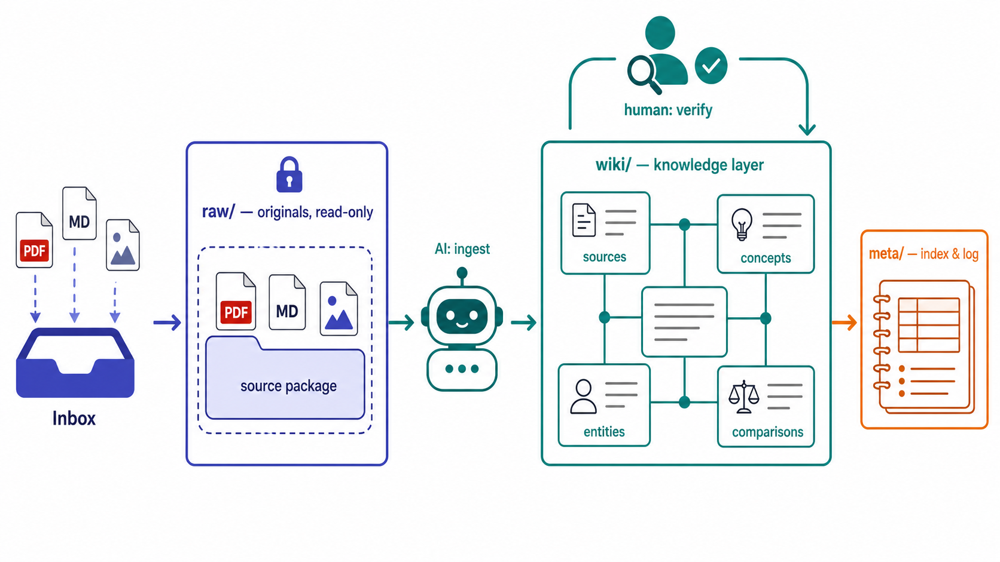
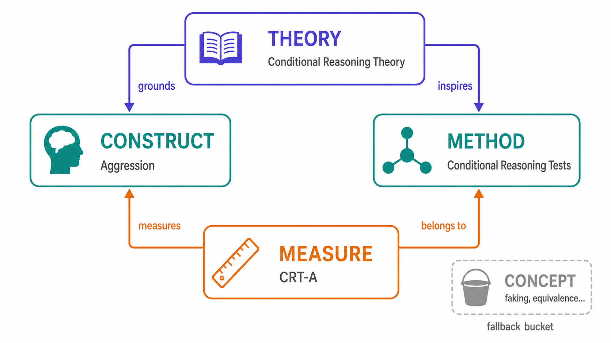
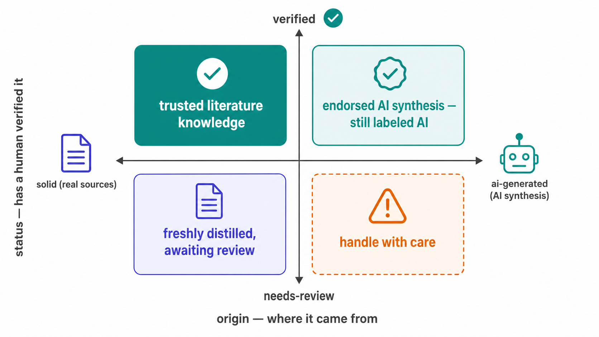
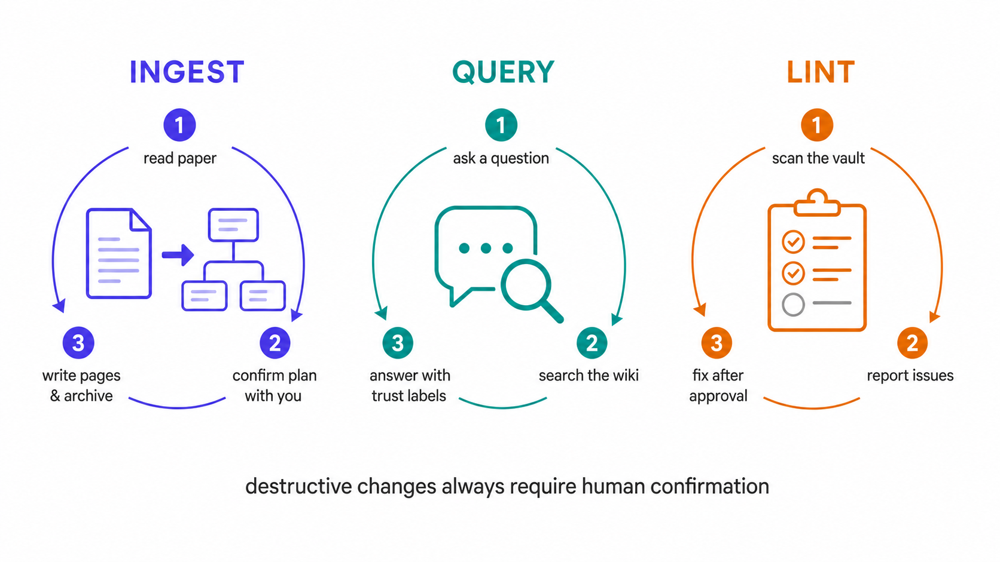

# Psych-Wiki-Obsidian — 给心理学研究者的知识库框架

[](https://opensource.org/licenses/MIT) [](https://obsidian.md)

**简体中文** | [English](README.en.md)

> 这是一个基于 [Karpathy 的 LLM Wiki](https://gist.github.com/karpathy/442a6bf555914893e9891c11519de94f) 理念、为心理学学生和研究者设计的 Obsidian 知识库框架。
> 它解决以下问题：文献读了就忘，笔记散落各处，知识之间无法形成有效关联。本库的解决方案，是写一部写给 AI 看的规则（[SCHEMA.md](SCHEMA.md)）：无论接手的是 Claude Code、Codex，还是将来的某个 Agent，都按同一套标准替你维护知识。



## 设计理念

### 唯一行动准则

[SCHEMA.md](SCHEMA.md) 是全库唯一的权威规则：目录如何组织、页面如何命名、frontmatter 如何填写、AI 在何种情形下必须先征求你的意见，皆以成文之法写定于此。任何 Agent 接手之前，须先通读它。换 AI 不换规则——知识库的一致性系于这部行动准则，而不系于任何一家工具。

### 三个基本特点

- **可追溯**：任何一条知识都能沿着 wikilink 回到出处：由概念页，至来源摘要页，最终抵达 `raw/` 中的原始资料。
- **可复利**：新页面经由 wikilink、frontmatter 与索引汇入既有网络；知识在引用中增殖，而不在文件夹里沉睡。
- **可生长**：允许先立一个只有一句话定义的雏形页（stub），待新文献到来，再逐步长成正式页面。没有哪一页被要求一次写完，正如没有哪个想法被要求一次成熟。

### 三层目录结构

```
raw/                  原始资料层，只进不出，是唯一事实来源
  papers/             论文来源包（每篇一个文件夹：PDF + 全文 MD + 图片）
  articles/           文章来源包（公众号 / 网页等）
  notes/              课堂笔记 / 读书笔记 / 随想
  media/              跨来源的独立媒体素材
wiki/                 自 raw 提炼出的知识层，由 AI 维护
  sources/            来源摘要页（一篇文献一页）
  concepts/           概念页（按 research_role 细分）
  entities/           实体页（人物、书籍、项目）
  comparisons/        比较页 / 跨域连接页
  overview/           自动总览看板
meta/                 维护层，全库的目录与时间线
  index.md            全库索引
  log.md              操作日志
Inbox/                待整理资料（处理后归档进 raw/）
SCHEMA.md             AI 的唯一行动准则
CLAUDE.md / AGENTS.md 各家 Agent 的入口门牌
```

## 心理学研究骨架

这是本库与通用知识库最深的分别。在心理学研究者眼里，一篇文献会自然分解为四种成分：理论、构念、方法与测验。本库将这种区分写进了知识的结构：每个心理学概念页，必须标注 `research_role`。



| research_role | 含义 | 例 |
|---|---|---|
| `theory` | 理论 / 理论视角 | 条件推理理论、社会认知理论 |
| `construct` | 要测量的潜在构念 / 特质 / 变量 | 攻击性、成就动机 |
| `method` | 测量方法 / 研究范式 / 采集技术 | 条件推理测验、评价中心、眼动技术 |
| `measure` | 具体的测验 / 工具 / 量表 | CRT-A、Buss-Perry 攻击问卷 |
| `concept` | 兜底类：现象 / 框架 / 方法学概念 | 作假、测量等价性 |

&nbsp;

四种角色由可查询的关系连成一张网。例如：

> **条件推理理论**（theory）主张，人格和动机塑造着无意识的辩解机制；这些机制使**攻击性**（construct）成为可测之物；测量该构念的具体工具为 **CRT-A**（measure）；而 CRT-A 又隶属于**条件推理测验**（method）这一方法，并且与 CRT-P、CRT-RMS 等测验适用同一套开发流程和规范。

这套分类方法的回报是实在的：

- **按研究的思路浏览。** 总览看板自动按角色分组；“所有测某个 `construct` 的工具”，或某 `method` 下具体由哪些 `measure`，皆是一条查询便可穷尽的问题。
- **每种角色各有底线模板。** construct 页必有“定义、测量、来源”，measure 页必有“测量构念与维度、信效度、例题”，theory 页必有“核心主张”。AI 依模板补齐，不同文献炼出的页面，便有了可相互对照的骨架。
- **存疑则归底类。** 分类有明确的判断次序；判断不了的一律归入 `concept`——宁可保守，不为归类强作推断。

## 双重保险：来源与核实

AI 时代知识管理真正的危险，不在于 AI 会出错，而在于它出错时的语气，与正确时一模一样。本库的对策，是用两个正交的字段，将“来源性质”与“核实状态”分开来记：



| | `status: needs-review` | `status: verified` |
|---|---|---|
| **`origin: solid`** | AI 从现实资料中提炼的知识，待你过目 | 你核实过的知识 |
| **`origin: ai-generated`** | AI 生成，或你与 AI 讨论的产物，最当警惕 | AI 生成但经你核实 |

&nbsp;

铁律有三：AI 新建的页面一律 `needs-review`；唯有你亲眼看过，才可改为 `verified`；AI 生成的内容，永远不能借核实之手“洗白”为一手资料——`verified` 改变的是核实状态，改变不了来源的出身。

## 工作流



| 工作流 | 你的指令 | AI 的行动 |
|---|---|---|
| **Ingest** | “ingest 一下 `Inbox/` 这篇文献” | 读文献 → 与你确认拟建页面清单 → 归档原文至 `raw/` 来源包 → 写来源摘要页 → 提炼概念页 → 更新索引与日志 |
| **Query**&nbsp; | “基于库中的知识，CRT 的抗作假性如何？” | 经索引定位相关页 → 必要时回溯 raw 原文 → 回答时区分已核实与待核实内容 → 不擅自写回 |
| **Lint**  | “对知识库进行一次 Lint / 健康检查” | 全库扫描：frontmatter 合规、链接断链、命名违规、模板缺节、孤立页 → 生成分级问题清单 → 经你确认后修复 |

&nbsp;

凡破坏性操作——批量重命名、移动、删除——必先列出清单，经你确认而后行。

## 快速开始
### 1. 获取本库

如果你熟悉 Git，可在终端中将本仓库克隆到本地：

```bash
git clone https://github.com/zhongzhengshen/Psych-Wiki-Obsidian.git
```

如果你暂时不使用 Git，也可在 GitHub 项目页点击 **Code → Download ZIP**，解压后得到本库文件夹。

最后，在 [Obsidian](https://obsidian.md) 中选择“打开本地仓库”，打开刚刚克隆或解压得到的文件夹。

### 2. 启用总览看板（可选）

总览页依赖 **Dataview** 插件：可在设置——第三方插件中关闭安全模式，并在社区插件市场中安装 Dataview，在其设置中开启 **JavaScript 查询**，并启用 CSS 片段 `.obsidian/snippets/overview-cards.css`。

### 3. 接入 AI Agent

本库的主要内容均为 Markdown 文档——**凡能读写文件夹、肯照 SCHEMA 办事的 Agent，皆可胜任**：

- **方式 A · 在 Obsidian 内**：安装第三方插件 Claudian，将 Claude Code / Codex 等的 CLI 路径填入设置，即可在侧边栏的聊天面板里与 Agent 对话。
- **方式 B · 在终端 / Agent 内**：以本库为工作目录启动 Claude Code / Codex 等，根目录的 `CLAUDE.md` / `AGENTS.md` 会自动将 Agent 引向 SCHEMA。

### 4. 日常使用

1. **收纳**：将资料放入 `Inbox/`，确定类型的可放入 `raw/` 对应的文件夹下。
2. **提炼**：对 AI 说 “ingest 一下 Inbox/某篇文献”，它会呈上拟建拟改的清单，你点头，它才动手。
3. **查看**：在 `wiki/` 中查看相应的页面，在 `wiki/overview/` 中按研究角色分组浏览，在 Obsidian 的关系图谱中查看知识网络，在 `meta/index.md` 查询全量目录。

## 致谢

- 本知识库的结构和规则理念源自 [Andrej Karpathy 的 LLM Wiki Gist](https://gist.github.com/karpathy/442a6bf555914893e9891c11519de94f)。
- 感谢 [Claude Code](https://claude.com/claude-code) 与 [Codex](https://openai.com/codex)：本库的规则由它们参与迭代，日常亦由它们维护——这件事本身，恰是对本库构想的一次验证。

## License

本项目以 [MIT License](LICENSE) 发布。

---
